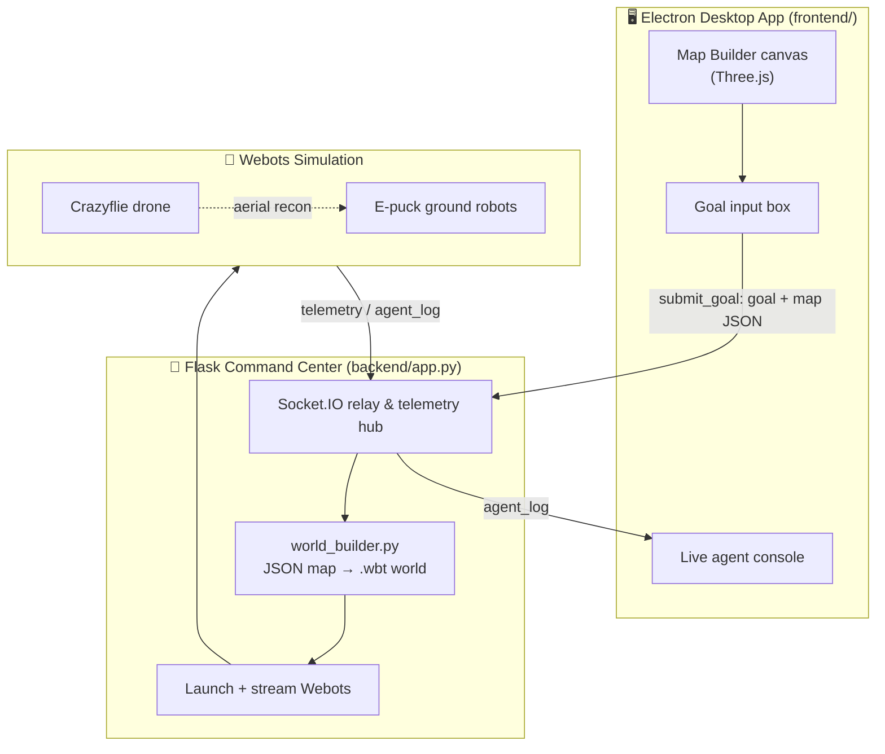
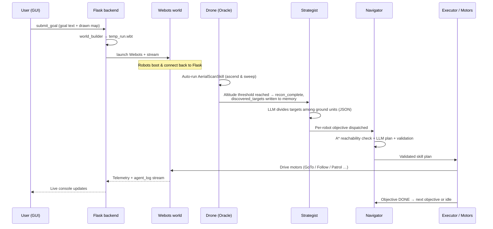

# AutoSim — Sovereign Multi-Agent Robotics Framework (with GUI)

> Draw a map, type a goal in plain English, and watch a swarm of simulated robots
> reason about it, divide the work between themselves, and carry out the mission
> inside a real physics simulator.

AutoSim is an end-to-end platform for **LLM-driven autonomous robotics**. You sketch an
environment (walls, targets, ground robots, a drone) on a 3D canvas, give a natural-language
objective such as *“All robots follow one e-puck”* or *“Visit every target”*, and the system:

1. compiles your sketch into a real [Webots](https://cyberbotics.com/) physics world,
2. boots that world and streams it live into the desktop app,
3. wakes a hierarchy of AI agents that perceive the world, plan a strategy, allocate tasks,
   verify routes with classical pathfinding, and drive the robots’ motors — and
4. streams every decision back to a live console so you can watch the swarm think.

---

## Table of Contents

- [What this project is](#what-this-project-is)
- [Architecture at a glance](#architecture-at-a-glance)
- [The two cognitive engines](#the-two-cognitive-engines)
- [The AI agent stack](#the-ai-agent-stack)
- [The robotic skill library](#the-robotic-skill-library)
- [The end-to-end robotic workflow](#the-end-to-end-robotic-workflow)
- [Shared memory & world state](#shared-memory--world-state)
- [Pathfinding (A\*)](#pathfinding-a)
- [Project layout](#project-layout)
- [Tech stack](#tech-stack)
- [Getting started](#getting-started)
- [Configuration](#configuration)
- [How to use it](#how-to-use-it)
- [Known quirks & notes for contributors](#known-quirks--notes-for-contributors)

---

## What this project is

AutoSim joins four worlds into one loop:

| Layer | Technology | Responsibility |
|-------|-----------|----------------|
| **Desktop GUI** | Electron + Three.js | A “Command Center” where you draw the map and issue the mission. |
| **Command backend** | Flask + Flask-SocketIO | The bridge. Generates worlds, launches Webots, relays logs, and (optionally) hosts the central brain. |
| **Physics simulator** | Webots R2025a | Runs real rigid-body physics for e-puck ground robots and a Crazyflie drone. |
| **AI brains** | LangGraph + LangChain + Groq LLM | Perceive, strategize, plan, and validate the robots’ actions. |

The signature behaviour is a **“drone-first recon, then swarm deployment”** pattern: a drone
takes off, scans the arena from above to discover where the targets are, and only *then* does the
ground swarm get woken up and assigned work based on what was found.

---

## Architecture at a glance



The GUI and backend talk over a local **WebSocket** (Socket.IO) on port `5000`. Webots streams its
own rendered viewport to the app over its built-in web stream on port `1234`.

---

## The two cognitive engines

This repo intentionally ships **two different ways of giving the robots a brain**. They share the
same skills, pathfinder, and GUI, but differ in *where the thinking happens*.

### 1. Decentralized “edge-brain” (currently wired by the world builder)

Each robot runs a **complete cognitive stack inside Webots**, in the
`backend/controllers/autosim_supervisor/` controller. Every robot is its own sovereign agent: it
perceives, strategizes, plans, and acts for itself, talking directly to the Groq LLM. This is the
controller `world_builder.py` actually assigns to every e-puck and drone, so it is the default
runtime path.

### 2. Centralized “swarm cognitive engine” (LangGraph)

A single brain lives in the Flask process (`backend/graph/`), built with **LangGraph**. The robots
become *thin clients* (`backend/controllers/autosim_agent/`) that only stream telemetry and wait for
plans. The central graph runs a Strategist node, then fans out one Navigator sub-graph per robot in
parallel (a map-reduce pattern), and pushes finished plans back to each robot over the socket.

> **In short:** the `autosim_supervisor` controller = *every robot thinks for itself*; the
> `graph/` engine + `autosim_agent` controller = *one orchestrator thinks for the whole swarm*.
> Both implement the same mission logic; they are two takes on the same idea.

---

## The AI agent stack

Whichever engine is active, the same four-role hierarchy does the reasoning. The names in
parentheses are the personas the system uses in its console logs.

### 🛰️ Perception Agent (“The Oracle”)
*`perception_agent.py`*

Turns raw physics into meaning. Every tick it reads each object’s position relative to the robot,
classifies it into a compass quadrant (North-East, North-West, …), measures distance, and writes a
human-readable summary (e.g. *“Detected 3 targets and 8 walls. Blocked regions in: North-West.”*).

It also owns the **aerial-recon trigger**: it watches the drone’s altitude, and once the drone
climbs past the threshold it walks the Webots scene tree, collects every `TARGET_*` node’s
coordinates, writes them into shared memory as `discovered_targets`, and flips `recon_complete = True`
— which is what wakes the ground swarm.

### 🧭 Mission Director (“The Strategist” / CEO node)
*`mission_director.py` (edge) · `strategist_node` in `graph/nodes.py` (central)*

The orchestrator. It will not plan until recon is complete. Once targets are known, it sends the
LLM the user’s command plus the list of discovered targets and active ground units, and asks for a
**fair division of labour** as strict JSON — one objective list per robot, no duplicate assignments
unless the user explicitly asked the robots to group up. The prompt template scales automatically to
however many robots exist. If the drone found nothing, it falls back to an “explore the environment”
objective.

### 🗺️ Navigator Agent (“The Tactician”)
*`navigator_agent.py` (edge) · `navigator_node` + `tools.py` (central)*

Takes one high-level objective (e.g. *“Navigate to TARGET_0”*) and turns it into a concrete sequence
of skills. Crucially, it is **grounded in physics before it asks the LLM**:

- It first runs A\* against the known walls to compute which targets are *actually reachable*, and
  tells the LLM it may **only** target IDs on that list.
- The LLM returns a JSON plan with a confidence score; the Navigator then **validates** it —
  rejecting any hallucinated skill, any missing required parameter, and any `GoToTargetSkill`
  aimed at an unreachable target.
- It retries up to three times (feeding the error back into the prompt) and falls back to a safe
  `WanderSkill` if the LLM never produces a valid plan.

In the centralized engine this is a true **ReAct loop**: the Navigator can call tools
(`check_path_feasibility`, `calculate_spatial_relationship`) before committing to a final
`dispatch_physical_action`, and LangGraph routes it back through the tool node each time.

### ⚙️ Plan Executor (“The Body”)
*`executor.py`*

A skill **factory and state machine**. It pops steps off the plan queue, instantiates the matching
skill object with the right hardware handles and parameters, runs `start → update (per tick) → stop`,
and reports `RUNNING / DONE / FAILED` back up to the controller loop. Drones get an automatic
`AerialScanSkill` injected at boot so recon happens without any planning.

---

## The robotic skill library

*`skills.py`* — every physical behaviour the robots can perform. All skills inherit from `BaseSkill`
and share the same lifecycle (`start`, `update`, `stop`, `is_complete`), so the executor can chain
them freely.

| Skill | What it does |
|-------|--------------|
| **SpinScanSkill** | Rotates in place for a fixed duration to look around. |
| **WanderSkill** | Explores semi-randomly, steering away from obstacles using the proximity sensors. |
| **AvoidObstacleSkill** | Reactive safety reflex — triggered directly by the control loop when front sensors spike, overriding the current plan. |
| **GoToTargetSkill** | Drives to a target node using closed-loop heading + distance control (turn toward bearing, then advance until within tolerance). |
| **PatrolSkill** | Visits a list of waypoints in sequence by composing `GoToTargetSkill`s. |
| **AerialScanSkill** | The drone routine: a phased `ASCEND → SWEEP → ASCEND_FINAL → HOVER` state machine that lifts off, spins a 360° camera sweep, and holds altitude. |
| **FollowLeaderSkill** | Tails a named leader robot, maintaining a safe follow distance — the basis of swarm flocking. |

The Navigator advertises a registry (`AVAILABLE_SKILLS`) describing each skill and its required
parameters, so the LLM can only ever choose from real, executable behaviours.

---

## The end-to-end robotic workflow

Here is one full mission, from click to completion:



Step by step:

1. **Design.** You drop walls, targets, e-pucks, and a drone onto the canvas and write a goal.
2. **Compile.** `world_builder.generate_wbt()` translates the map JSON into a valid `.wbt` file,
   scaling coordinates, mapping the canvas’s Z-axis onto Webots’ Y-axis, and attaching the
   controller to each robot.
3. **Boot.** Flask launches Webots in streaming mode; each robot’s controller connects back over
   Socket.IO and announces *“Hardware online.”*
4. **Recon.** The drone immediately ascends and sweeps. On reaching altitude, the Oracle reads every
   target’s true coordinates straight from the simulation tree and uploads them to shared memory.
5. **Strategize.** Recon completion wakes the Strategist, which asks the LLM to split the discovered
   targets fairly across the ground swarm and writes one objective list per robot.
6. **Plan & verify.** Each robot’s Navigator filters targets through A\*, prompts the LLM for a skill
   plan, and rejects anything unreachable or invalid before accepting it.
7. **Execute.** The Executor runs the plan tick-by-tick, driving the motors. The reactive
   obstacle-avoidance arbiter can pre-empt at any moment for safety.
8. **Advance.** When an objective finishes, the robot pops the next one (re-planning each time);
   when its list is empty it reports *“All assigned Mission Objectives Accomplished”* and idles.
   A failed plan triggers a strategic re-plan.

The whole loop is **event-driven**: physics never block on the LLM. Telemetry and skill-completion
events “wake the brain” only when a new decision is actually needed.

---

## Shared memory & world state

Both engines keep a single source of truth that every agent reads from and writes to.

- **Edge engine — `blackboard.py`.** A nested dictionary partitioned into `mission`,
  `semantic_state`, `execution`, `memory`, `robots`, `runtime`, and raw `world_state`, with per-agent
  sub-keys so robots never clobber each other’s data.
- **Central engine — `state.py`.** A typed LangGraph `SwarmState` (`TypedDict`) backed by **Pydantic**
  domain models (`Position`, `Skill`, `Objective`, `RobotState`, …) and custom **reducers** that
  define how concurrent updates merge — e.g. robot positions are merged per-agent, discovered targets
  are de-duplicated, and chat messages are appended. This is what lets many Navigator sub-graphs write
  to one global state in parallel without conflicts.

`world_state.py` (inside the controller) is the perception front-end: it caches static walls once,
re-reads moving targets and the robot’s own pose every tick, bundles proximity-sensor readings, and
publishes a clean snapshot for the agents.

---

## Pathfinding (A\*)

*`pathfinder.py`* — a classical **A\* search** that grounds the LLM’s decisions in geometry:

- discretizes the continuous arena into a grid (`cell_size = 0.1 m`),
- inflates obstacles by a padding radius so robots don’t clip corners,
- searches in 8 directions (diagonals cost √2 ≈ 1.414),
- uses a Euclidean heuristic and bails out gracefully after a max-iteration cap.

It is used two ways: as a **feasibility filter** (the Navigator only lets the LLM target reachable
objects) and, in the central engine, as a **callable LLM tool** (`check_path_feasibility`).

---

## Project layout

```
AUTOSUM-WITH-GUI/
├── package.json                 # Electron app + `npm start` launcher
├── frontend/                    # Electron desktop "Command Center"
│   ├── main.js                  # Electron entry (creates the window)
│   ├── index.html               # UI shell + Socket.IO client + console
│   └── map_builder.js           # Three.js 3D map editor + map export
└── backend/
    ├── app.py                   # Flask + Socket.IO server (the bridge & central brain host)
    ├── world_builder.py         # Map JSON → Webots .wbt world generator
    ├── worlds/                  # Generated worlds land here (temp_run.wbt)
    ├── graph/                   # ── Centralized LangGraph "swarm cognitive engine" ──
    │   ├── workflow.py          #    Graph wiring: Strategist → parallel Navigators → tools
    │   ├── nodes.py             #    Strategist & Navigator LLM nodes
    │   ├── tools.py             #    LLM tools: pathfinding, spatial math, action dispatch
    │   ├── state.py             #    Typed SwarmState + Pydantic models + reducers
    │   └── pathfinder.py        #    A* implementation
    └── controllers/
        ├── autosim_supervisor/  # ── Decentralized "edge-brain" (DEFAULT runtime) ──
        │   ├── autosim_supervisor.py  #  Per-robot hierarchical agentic loop
        │   ├── perception_agent.py    #  The Oracle
        │   ├── mission_director.py    #  The Strategist
        │   ├── navigator_agent.py     #  The Tactician
        │   ├── executor.py            #  Skill factory / state machine
        │   ├── skills.py              #  All robot behaviours
        │   ├── blackboard.py          #  Shared memory
        │   ├── world_state.py         #  Perception front-end
        │   ├── llm_client.py          #  Groq + Gemini clients
        │   └── pathfinder.py          #  A*
        └── autosim_agent/       # ── Thin-client controller for the central LangGraph engine ──
```

> **Heads-up:** the project ships with a `venv/` checked in — you should delete it and create your
> own (see below). It is not part of the source.

---

## Tech stack

**Frontend**

- **Electron** — desktop shell
- **Three.js** — the 3D map-builder canvas
- **Tailwind CSS** — styling
- **Socket.IO client** — realtime link to the backend

**Backend & AI**

- **Flask** + **Flask-SocketIO** — command server and realtime hub
- **LangGraph** + **LangChain Core** — the central agentic graph
- **Groq** (`langchain-groq` / `groq`) — ultra-low-latency LLM inference, model `openai/gpt-oss-120b`
- **Google Generative AI** (Gemini) — optional alternative LLM client
- **Pydantic** + **typing-extensions** — typed state models
- **python-dotenv** — config

**Simulation**

- **Webots R2025a** — physics engine, with the **E-puck** and **Crazyflie** PROTO models
- **python-socketio** — lets each Webots controller talk back to Flask

---

## Getting started

### Prerequisites

- **Python 3.11**
- **Node.js** (LTS) and **npm**
- **Webots R2025a**, with the `webots` executable available on your system `PATH`
- A **Groq API key** (free tier works) — and optionally a **Google API key** for Gemini

### 1. Clone and enter the project

```bash
git clone <your-repo-url>
cd AUTOSUM-WITH-GUI
```

### 2. Python environment

Create a fresh virtual environment and install from [`requirements.txt`](requirements.txt):

```bash
python -m venv venv
# Windows:
venv\Scripts\activate
# macOS / Linux:
source venv/bin/activate

pip install -r requirements.txt
```

> The pins in `requirements.txt` are conservative lower bounds. For a fully reproducible
> build, run `pip freeze > requirements.txt` from your own working environment to capture the
> exact versions you tested against.

> **Webots controllers** run under Webots’ own Python and additionally need the `controller` module
> (bundled with Webots) plus `python-socketio`. Make sure Webots is configured to use a Python
> interpreter that has `python-socketio`, `groq`, and `python-dotenv` installed.

### 3. Node / Electron dependencies

```bash
npm install
```

### 4. Run it

```bash
npm start
```

The `start` script uses **concurrently** to launch the Flask backend and the Electron app together:

```jsonc
"start": "concurrently \"python backend/app.py\" \"electron frontend/main.js\""
```

The backend comes up on port `5000`; the desktop window opens automatically. When you start a
mission, Webots launches and its live stream appears inside the app.

---

## Configuration

Copy the provided [`.env.example`](.env.example) to **`.env`** in the project root and fill in your
keys (`.env` is git-ignored, so your secrets are never committed):

```bash
cp .env.example .env        # macOS / Linux
copy .env.example .env      # Windows
```

```dotenv
GROQ_API_KEY=your_groq_key_here
GOOGLE_API_KEY=your_google_key_here   # optional, only if you use the Gemini client
```

Useful tunables in code:

- **LLM model** — `openai/gpt-oss-120b`, set in `nodes.py` / `autosim_supervisor.py`. Temperature is
  `0.0` for deterministic, repeatable robot behaviour.
- **A\* resolution** — `cell_size` and `obstacle_padding` in `pathfinder.py`.
- **Drone recon altitude** — the trigger height in `perception_agent.py` (edge) / `app.py` (central).
- **Default mission goal** — hard-coded in `autosim_supervisor.py` as a starting example; the GUI
  goal overrides it.

---

## How to use it

1. **Launch** the app with `npm start`. The status dot turns green when the backend connects.
2. **Build a map** on the canvas using the toolbar: place **walls**, **targets**, one or more
   **e-puck** ground robots, and a **drone**. (If you place no e-pucks, the system adds a default
   `epuck_1` at the origin.)
3. **Write a goal** in plain English in the objective box — e.g. *“Send each robot to a different
   target”* or *“All robots follow one e-puck.”*
4. **Press Run.** The backend compiles your map, boots Webots, and the mission begins.
5. **Watch the console.** Every agent narrates its reasoning live — the Oracle reporting targets, the
   Strategist dividing labour, the Navigator securing tactical plans with confidence scores, and the
   Executor activating skills.

---

## Known quirks & notes for contributors

This is a research/portfolio project, so a few things are worth flagging before you dig in:

- **Two parallel architectures coexist.** `world_builder.py` currently assigns the
  `autosim_supervisor` (decentralized edge-brain) controller to every robot, so that is the live
  path. The `graph/` LangGraph engine and the `autosim_agent` thin-client controller are a complete
  alternative implementation — to run *that* path you’d point the world builder’s `controller` field
  at `autosim_agent` and drive planning from `app.py`’s cognitive engine.
- **`requirements.txt` and `.env.example` are provided**, but their version pins are inferred lower
  bounds — run `pip freeze` from a known-good environment to lock exact versions for reproducibility.
- **Recon-altitude threshold** differs between the edge perception agent and the central oracle in
  `app.py` — keep them in sync if you change the drone’s scan height.
- **The committed `venv/`** should be removed from version control; rebuild it locally.
- **Webots must be on PATH.** If you see *“Webots executable not found in PATH”* in the console,
  that’s the cause.

---

*Authored for the AutoSim — Sovereign Robotics Framework.*
